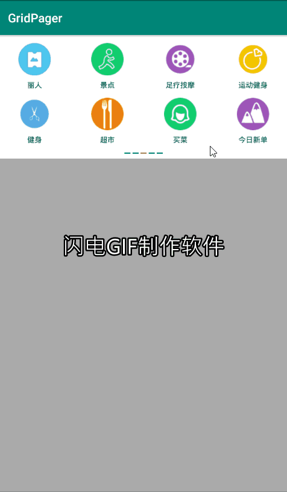

# GridPager
GridPager组件，几行代码即可实现类似美团APP的多分类分页显示，链式调用，极简接入。



# 1、Add it in your root build.gradle at the end of repositories:
```
allprojects {
		repositories {
			...
			maven { url 'https://jitpack.io' }
		}
	}
```
# 2、Add the dependency
```
dependencies {
	        implementation 'com.github.mtjsoft:GridPager:v1.0.0'
	}
```
# 3、xml
```
<cn.mtjsoft.www.gridpager.GridPager
        android:id="@+id/gridpager"
        android:layout_width="match_parent"
        android:layout_height="wrap_content"
        app:verticalSpacing="10dp"
        app:img_width="50dp"
        app:img_height="50dp"
        app:text_color="@color/colorPrimary"
        app:text_size="10sp"
        app:imgtext_margin="10dp"
        app:row_count="2"
        app:column_count="4"
        app:point_width="15dp"
        app:point_height="2dp"
        app:point_is_circle="false"
        app:point_margin="3dp"
        app:point_normal_color="@color/colorPrimary"
        app:point_select_color="@color/colorAccent">
    </cn.mtjsoft.www.gridpager.GridPager>
```
# 4、属性说明
属性  | 说明
------------- | -------------
verticalSpacing  | 设置item的纵向间距 默认10dp
img_width  | 设置图片宽度 默认50dp
img_height  | 设置图片高度 默认50dp
text_color  | 设置文字颜色 默认黑色
imgtext_margin  | 设置文字与图片的间距 默认5dp
text_size  | 设置文字大小 默认10sp
row_count  | 设置每页行数 默认2
column_count  | 设置每页列数 默认4
point_width  | 设置指示器的item宽度 默认8dp
point_height  | 设置指示器的item高度 默认8dp
point_margin  | 设置指示器的item的间距 默认8dp
point_normal_color  | 指示器item未选中的颜色 默认灰色
point_select_color  | 指示器item选中的颜色 默认红色
point_is_circle  | 指示器的item是否为圆形，默认圆形直径取宽高的最小值

# 5、代码实现。链式调用，只需要设置总数量即可。数据绑定完全自定义，不受任何图片加载框架限制，更加自由。
```
GridPager gridPager = findViewById(R.id.gridpager);
        gridPager
                // 设置数量总条数
                .setDataAllCount(titles.length)
                // 数据绑定
                .setItemBindDataListener(new GridPager.ItemBindDataListener() {
                    @Override
                    public void BindData(ImageView imageView, TextView textView, int position) {
                        // 自己进行数据的绑定，灵活度更高，不受任何限制
                        imageView.setImageResource(iconS[position]);
                        textView.setText(titles[position]);
                    }
                })
                // Item点击
                .setGridItemClickListener(new GridPager.GridItemClickListener() {
                    @Override
                    public void click(int position) {
                        Toast.makeText(getBaseContext(), "点击了" + titles[position], Toast.LENGTH_SHORT).show();
                    }
                })
                .show();
```
# 5、代码中也可直接设置属性（如果xml与代码都设置了， 最终以代码设置为准）
```
        gridPager
                // 设置数量总条数
                .setDataAllCount(titles.length)
                // 设置item的纵向间距
                .setVerticalSpacing(20)
                // 设置图片宽度
                .setImageWidth(80)
                // 设置图片高度
                .setImageHeight(80)
                // 设置文字与图片的间距
                .setTextImgMargin(10)
                // 设置文字颜色
                .setTextColor(ContextCompat.getColor(getBaseContext(),R.color.colorPrimaryDark))
                // 设置文字大小
                .setTextSize(12)
                // 设置每页行数
                .setRowCount(2)
                // 设置每页列数
                .setColumnCount(4)
                // 设置指示器的item宽度
                .setPointChildWidth(15)
                // 设置指示器的item高度
                .setPointChildHeight(3)
                // 设置指示器的item的间距
                .setPointChildMargin(5)
                // 指示器的item是否为圆形，默认圆形直径取宽高的最小值
                .setPointIsCircle(false)
                // 指示器item未选中的颜色
                .setPointNormalColor(ContextCompat.getColor(getBaseContext(),R.color.colorPrimary))
                // 指示器item选中的颜色
                .setPointSelectColor(ContextCompat.getColor(getBaseContext(),R.color.colorAccent))
                // 数据绑定
                .setItemBindDataListener(new GridPager.ItemBindDataListener() {
                    @Override
                    public void BindData(ImageView imageView, TextView textView, int position) {
                        // 自己进行数据的绑定，灵活度更高，不受任何限制
                        imageView.setImageResource(iconS[position]);
                        textView.setText(titles[position]);
                    }
                })
                // Item点击
                .setGridItemClickListener(new GridPager.GridItemClickListener() {
                    @Override
                    public void click(int position) {
                        Toast.makeText(getBaseContext(), "点击了" + titles[position], Toast.LENGTH_SHORT).show();
                    }
                })
                .show();
```
